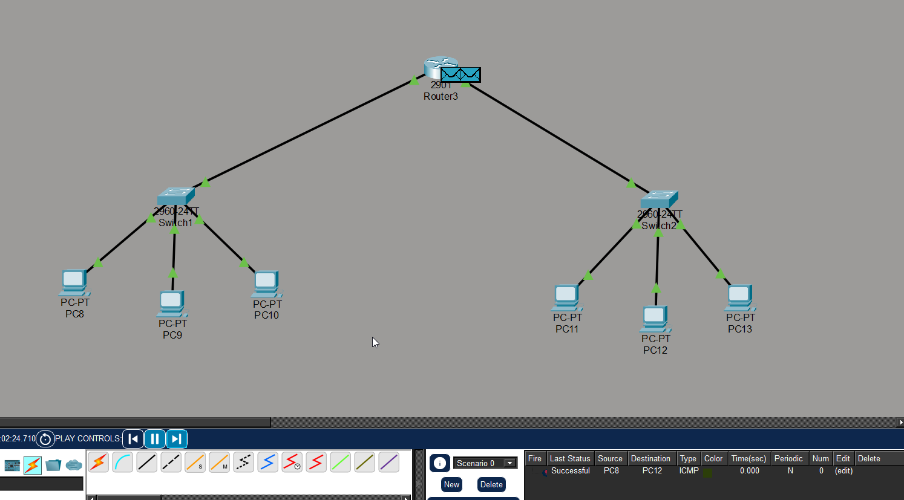
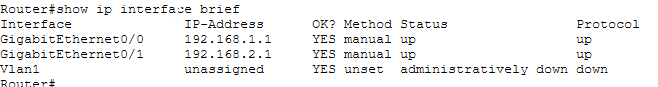
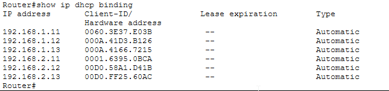
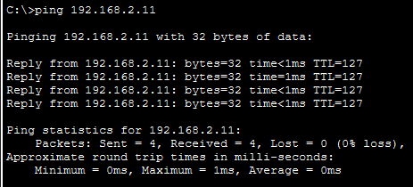

# 🖧 Cisco Packet Tracer Lab — Two-Subnet Routed Network with DHCP

**Author:** Ali  
**Tool:** Cisco Packet Tracer  
**Devices:** Cisco 2901 Router, 2x Cisco 2960-24TT Switch, 6x PCs  
**Date:** June 2026

---

## Objective

Design and configure a two-subnet routed network using a Cisco 2901 router and two 2960 switches, with the router acting as a centralized DHCP server for both subnets.

---

## Network Topology

```
                        [ Router3 - 2901 ]
                         /               \
                    G0/0                  G0/1
                 192.168.1.1           192.168.2.1
                      |                     |
               [ Switch1 ]             [ Switch2 ]
              /     |     \           /     |     \
           PC8     PC9   PC10      PC11   PC12   PC13
       .11/.12/.13 (DHCP)       .11/.12/.13 (DHCP)
```

> **Topology screenshot:**



---

## Addressing Table

| Device   | Interface        | IP Address    | Subnet Mask     | Default Gateway |
|----------|-----------------|---------------|-----------------|-----------------|
| Router3  | GigabitEthernet0/0 | 192.168.1.1 | 255.255.255.0 | —               |
| Router3  | GigabitEthernet0/1 | 192.168.2.1 | 255.255.255.0 | —               |
| PC8      | NIC              | DHCP (192.168.1.11) | 255.255.255.0 | 192.168.1.1 |
| PC9      | NIC              | DHCP (192.168.1.12) | 255.255.255.0 | 192.168.1.1 |
| PC10     | NIC              | DHCP (192.168.1.13) | 255.255.255.0 | 192.168.1.1 |
| PC11     | NIC              | DHCP (192.168.2.11) | 255.255.255.0 | 192.168.2.1 |
| PC12     | NIC              | DHCP (192.168.2.12) | 255.255.255.0 | 192.168.2.1 |
| PC13     | NIC              | DHCP (192.168.2.13) | 255.255.255.0 | 192.168.2.1 |

---

## Configuration Commands

### Router3 — Interface Configuration

```bash
enable
configure terminal

interface GigabitEthernet0/0
 ip address 192.168.1.1 255.255.255.0
 no shutdown
 exit

interface GigabitEthernet0/1
 ip address 192.168.2.1 255.255.255.0
 no shutdown
 exit
```

### Router3 — DHCP Configuration

```bash
ip dhcp excluded-address 192.168.1.1 192.168.1.10
ip dhcp excluded-address 192.168.2.1 192.168.2.10

ip dhcp pool LAN1
 network 192.168.1.0 255.255.255.0
 default-router 192.168.1.1
 dns-server 8.8.8.8
 exit

ip dhcp pool LAN2
 network 192.168.2.0 255.255.255.0
 default-router 192.168.2.1
 dns-server 8.8.8.8
 exit
```

### PCs — Set to DHCP

Each PC: **Desktop → IP Configuration → DHCP**

---

## Verification

### `show ip interface brief`

```
Interface              IP-Address      OK? Method Status   Protocol
GigabitEthernet0/0     192.168.1.1     YES manual up       up
GigabitEthernet0/1     192.168.2.1     YES manual up       up
Vlan1                  unassigned      YES unset  administratively down  down
```

> Both router interfaces are up/up confirming successful configuration.



---

### `show ip dhcp binding`

```
IP address       Client-ID/          Lease expiration   Type
                 Hardware address
192.168.1.11     0060.3E37.E03B      --                 Automatic
192.168.1.12     000A.41D3.B126      --                 Automatic
192.168.1.13     000A.4166.7215      --                 Automatic
192.168.2.11     0001.6395.0BCA      --                 Automatic
192.168.2.12     00D0.58A1.D41B      --                 Automatic
192.168.2.13     00D0.FF25.60AC      --                 Automatic
```

> All 6 PCs received automatic IPs from the correct subnet pool.



---

### Ping Test — PC8 → PC12 (cross-subnet)

```
Pinging 192.168.2.12 from PC8 (192.168.1.11) — Successful
```

> Confirms inter-subnet routing is working through Router3.



---

## What I Learned

- How to configure router interfaces and bring them up with `no shutdown`
- How DHCP works — the DORA process (Discover, Offer, Request, Acknowledge)
- How a router routes packets between two different subnets
- How to use `excluded-address` to reserve IPs for network devices
- How to verify network state using `show` commands in Cisco IOS

---

## Skills Demonstrated

`Cisco IOS CLI` · `IP Subnetting` · `DHCP Configuration` · `Inter-VLAN Routing` · `Network Troubleshooting` · `Cisco Packet Tracer`

---

## Files in This Repo

| File | Description |
|------|-------------|
| `README.md` | This documentation |
| `topology.png` | Network topology screenshot |
| `interface_brief.png` | show ip interface brief output |
| `dhcp_binding.png` | show ip dhcp binding output |
| `ping_success.png` | Successful ping verification |
| `lab.pkt` | Cisco Packet Tracer project file |
