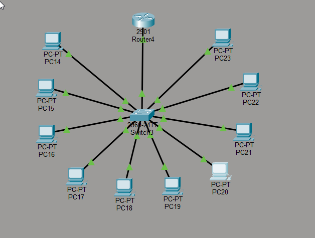
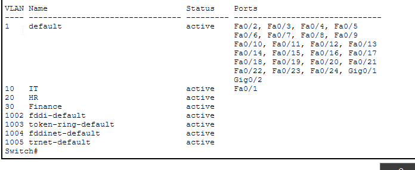
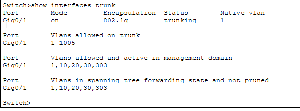
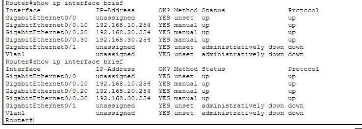
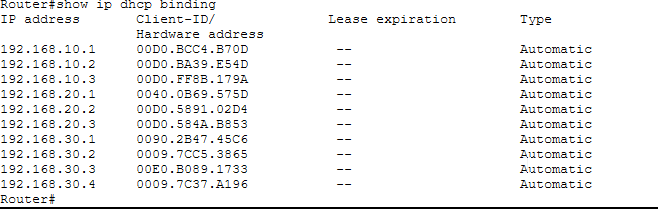
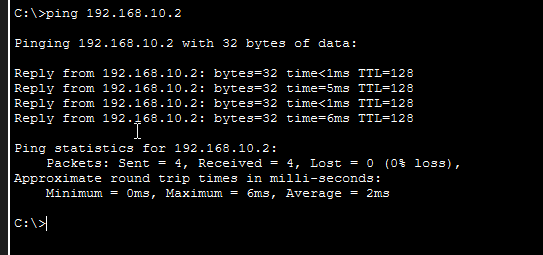

# 🔀 Cisco Packet Tracer Lab — VLAN Segmentation with Router on a Stick

**Author:** Ali  
**Tool:** Cisco Packet Tracer  
**Devices:** Cisco 2901 Router, Cisco 2960-24TT Switch, 10x PCs  
**Date:** June 2026

---

## Objective

Design and configure a VLAN-segmented network using a single Cisco 2960 switch with three VLANs (IT, HR, Finance), a trunk port, and a Cisco 2901 router configured as Router on a Stick to enable inter-VLAN routing and centralized DHCP for all three subnets.

---

## Network Topology

```
                        [ Router4 - 2901 ]
                                |
                           G0/0 (trunk)
                          G0/0.10 - 192.168.10.254
                          G0/0.20 - 192.168.20.254
                          G0/0.30 - 192.168.30.254
                                |
                        [ Switch3 - 2960 ]
                       Gi0/1 → trunk port
              /              |               \
         VLAN 10           VLAN 20          VLAN 30
          (IT)              (HR)           (Finance)
      Fa0/1,2,3          Fa0/4,5,6      Fa0/7,8,9,10
     PC14,15,16         PC17,18,19     PC20,21,22,23
```

> **Topology screenshot:**



---

## VLAN Plan

| VLAN | Name | Ports | Subnet | Gateway |
|------|------|-------|--------|---------|
| 10 | IT | Fa0/1, Fa0/2, Fa0/3 | 192.168.10.0/24 | 192.168.10.254 |
| 20 | HR | Fa0/4, Fa0/5, Fa0/6 | 192.168.20.0/24 | 192.168.20.254 |
| 30 | Finance | Fa0/7, Fa0/8, Fa0/9, Fa0/10 | 192.168.30.0/24 | 192.168.30.254 |

---

## Addressing Table

| Device | VLAN | IP Address | Subnet Mask | Default Gateway |
|--------|------|------------|-------------|-----------------|
| Router4 | — | G0/0.10: 192.168.10.254 | 255.255.255.0 | — |
| Router4 | — | G0/0.20: 192.168.20.254 | 255.255.255.0 | — |
| Router4 | — | G0/0.30: 192.168.30.254 | 255.255.255.0 | — |
| PC14 | 10 | DHCP (192.168.10.1) | 255.255.255.0 | 192.168.10.254 |
| PC15 | 10 | DHCP (192.168.10.2) | 255.255.255.0 | 192.168.10.254 |
| PC16 | 10 | DHCP (192.168.10.3) | 255.255.255.0 | 192.168.10.254 |
| PC17 | 20 | DHCP (192.168.20.1) | 255.255.255.0 | 192.168.20.254 |
| PC18 | 20 | DHCP (192.168.20.2) | 255.255.255.0 | 192.168.20.254 |
| PC19 | 20 | DHCP (192.168.20.3) | 255.255.255.0 | 192.168.20.254 |
| PC20 | 30 | DHCP (192.168.30.1) | 255.255.255.0 | 192.168.30.254 |
| PC21 | 30 | DHCP (192.168.30.2) | 255.255.255.0 | 192.168.30.254 |
| PC22 | 30 | DHCP (192.168.30.3) | 255.255.255.0 | 192.168.30.254 |
| PC23 | 30 | DHCP (192.168.30.4) | 255.255.255.0 | 192.168.30.254 |

---

## Configuration Commands

### Switch3 — Create VLANs

```bash
enable
configure terminal

vlan 10
 name IT
 exit

vlan 20
 name HR
 exit

vlan 30
 name Finance
 exit
```

### Switch3 — Assign Access Ports

```bash
interface FastEthernet0/1
 switchport mode access
 switchport access vlan 10
 exit

interface FastEthernet0/2
 switchport mode access
 switchport access vlan 10
 exit

interface FastEthernet0/3
 switchport mode access
 switchport access vlan 10
 exit

interface FastEthernet0/4
 switchport mode access
 switchport access vlan 20
 exit

interface FastEthernet0/5
 switchport mode access
 switchport access vlan 20
 exit

interface FastEthernet0/6
 switchport mode access
 switchport access vlan 20
 exit

interface FastEthernet0/7
 switchport mode access
 switchport access vlan 30
 exit

interface FastEthernet0/8
 switchport mode access
 switchport access vlan 30
 exit

interface FastEthernet0/9
 switchport mode access
 switchport access vlan 30
 exit

interface FastEthernet0/10
 switchport mode access
 switchport access vlan 30
 exit
```

### Switch3 — Configure Trunk Port

```bash
interface GigabitEthernet0/1
 switchport mode trunk
 exit
```

### Router4 — Router on a Stick (Sub-interfaces)

```bash
enable
configure terminal

interface GigabitEthernet0/0
 no shutdown
 exit

interface GigabitEthernet0/0.10
 encapsulation dot1Q 10
 ip address 192.168.10.254 255.255.255.0
 exit

interface GigabitEthernet0/0.20
 encapsulation dot1Q 20
 ip address 192.168.20.254 255.255.255.0
 exit

interface GigabitEthernet0/0.30
 encapsulation dot1Q 30
 ip address 192.168.30.254 255.255.255.0
 exit
```

### Router4 — DHCP Configuration

```bash
ip dhcp excluded-address 192.168.10.254
ip dhcp excluded-address 192.168.20.254
ip dhcp excluded-address 192.168.30.254

ip dhcp pool VLAN10
 network 192.168.10.0 255.255.255.0
 default-router 192.168.10.254
 dns-server 8.8.8.8
 exit

ip dhcp pool VLAN20
 network 192.168.20.0 255.255.255.0
 default-router 192.168.20.254
 dns-server 8.8.8.8
 exit

ip dhcp pool VLAN30
 network 192.168.30.0 255.255.255.0
 default-router 192.168.30.254
 dns-server 8.8.8.8
 exit
```

---

## Verification

### `show vlan brief` — Switch3

```
VLAN  Name      Status    Ports
10    IT        active    Fa0/1, Fa0/2, Fa0/3
20    HR        active    Fa0/4, Fa0/5, Fa0/6
30    Finance   active    Fa0/7, Fa0/8, Fa0/9, Fa0/10
```



---

### `show interfaces trunk` — Switch3

```
Port     Mode   Encapsulation  Status    Native vlan
Gi0/1    on     802.1q         trunking  1

Port     Vlans allowed and active in management domain
Gi0/1    1,10,20,30
```

> Trunk port carrying all 3 VLANs confirmed on Gi0/1.



---

### `show ip interface brief` — Router4

```
Interface              IP-Address       Status   Protocol
GigabitEthernet0/0     unassigned       up       up
GigabitEthernet0/0.10  192.168.10.254   up       up
GigabitEthernet0/0.20  192.168.20.254   up       up
GigabitEthernet0/0.30  192.168.30.254   up       up
```

> All three sub-interfaces up with correct IPs.



---

### `show ip dhcp binding` — Router4

```
IP address      Hardware address     Type
192.168.10.1    00D0.BCC4.B70D       Automatic
192.168.10.2    00D0.BA39.E54D       Automatic
192.168.10.3    00D0.FF8B.179A       Automatic
192.168.20.1    0040.0B69.575D       Automatic
192.168.20.2    00D0.5891.02D4       Automatic
192.168.20.3    00D0.584A.B853       Automatic
192.168.30.1    0090.2B47.45C6       Automatic
192.168.30.2    0009.7CC5.3865       Automatic
192.168.30.3    00E0.B089.1733       Automatic
192.168.30.4    0009.7C37.A196       Automatic
```

> All 10 PCs received automatic IPs from their correct VLAN subnet.



---

### Ping Test — Same VLAN (PC14 → PC15)

```
Pinging 192.168.10.2 with 32 bytes of data:
Reply from 192.168.10.2: bytes=32 time<1ms TTL=128
Reply from 192.168.10.2: bytes=32 time=5ms TTL=128
Reply from 192.168.10.2: bytes=32 time<1ms TTL=128
Reply from 192.168.10.2: bytes=32 time=6ms TTL=128

Packets: Sent = 4, Received = 4, Lost = 0 (0% loss)
```

> Intra-VLAN communication working correctly.



---

## How It Works

**VLANs** segment the switch into three isolated Layer 2 networks. Devices in different VLANs cannot communicate directly even on the same physical switch.

**Trunk port** (Gi0/1) carries all VLAN traffic between the switch and router on a single cable using 802.1Q tagging — each frame is tagged with its VLAN ID.

**Router on a Stick** — the router uses sub-interfaces (G0/0.10, G0/0.20, G0/0.30), one per VLAN. When a PC sends traffic to a different VLAN, it goes up the trunk to the router, the router routes it, and sends it back down the trunk to the destination VLAN.

**DHCP** pools on the router serve each VLAN separately — PCs automatically get the right IP for their subnet.

---

## What I Learned

- How VLANs logically segment a physical switch into multiple networks
- How 802.1Q trunk ports carry multiple VLANs on a single link
- How Router on a Stick enables inter-VLAN routing via sub-interfaces
- How to configure per-VLAN DHCP pools on a router
- How to verify VLAN and trunk configuration using show commands

---

## Skills Demonstrated

`VLANs` · `802.1Q Trunking` · `Router on a Stick` · `Inter-VLAN Routing` · `DHCP` · `Cisco IOS CLI` · `Cisco Packet Tracer`

---

## Files in This Repo

| File | Description |
|------|-------------|
| `README.md` | This documentation |
| `topology_vlan.png` | Network topology screenshot |
| `vlan_brief.png` | show vlan brief output |
| `interfaces_trunk.png` | show interfaces trunk output |
| `interface_brief_vlan.png` | show ip interface brief output |
| `dhcp_binding_vlan.png` | show ip dhcp binding output |
| `ping_vlan.png` | Ping verification screenshot |
| `lab_vlan.pkt` | Cisco Packet Tracer project file |
