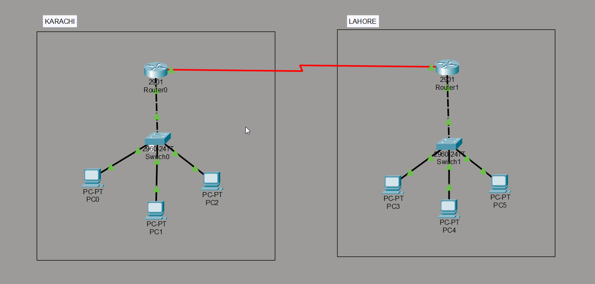
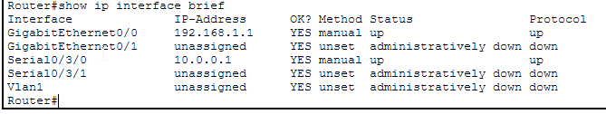
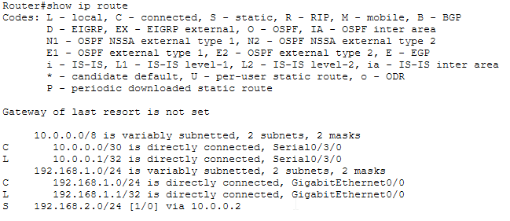
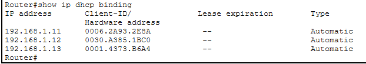
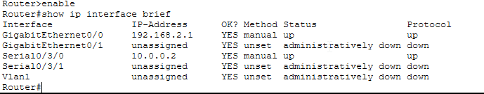
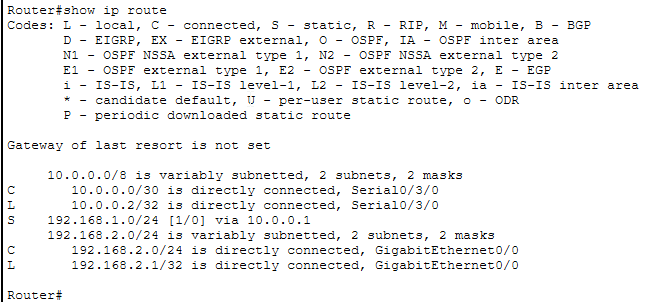
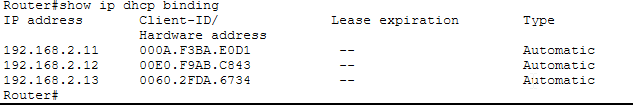
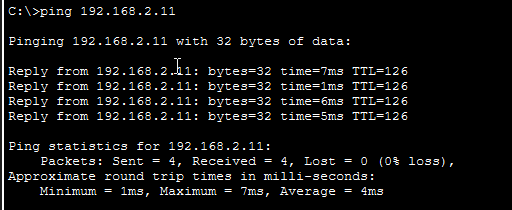

# 🏢 Cisco Packet Tracer Lab — Branch Office WAN Network

**Author:** Muhammad Ali Ahmed  
**Tool:** Cisco Packet Tracer  
**Devices:** 2x Cisco 2901 Router, 2x Cisco 2960-24TT Switch, 6x PCs  
**Date:** June 2026

---

## Objective

Design and configure a two-site enterprise WAN network simulating a Karachi head office and Lahore branch office connected via a serial WAN link. Each office has its own LAN with DHCP, and static routes enable inter-office communication across the WAN.

---

## Network Topology

```
        [KARACHI OFFICE]                          [LAHORE OFFICE]
        
        [ Router0 - 2901 ]  ----Se0/3/0----  [ Router1 - 2901 ]
          G0/0: 192.168.1.1   10.0.0.0/30    G0/0: 192.168.2.1
               |                                       |
          [ Switch0 ]                            [ Switch1 ]
         /     |     \                          /     |     \
       PC0    PC1    PC2                      PC3    PC4    PC5
   192.168.1.x (DHCP)                    192.168.2.x (DHCP)
```

> **Topology screenshot:**



---

## Addressing Table

| Device | Interface | IP Address | Subnet Mask | Purpose |
|--------|-----------|------------|-------------|---------|
| Router0 | GigabitEthernet0/0 | 192.168.1.1 | 255.255.255.0 | Karachi LAN gateway |
| Router0 | Serial0/3/0 | 10.0.0.1 | 255.255.255.252 | WAN link (DCE) |
| Router1 | GigabitEthernet0/0 | 192.168.2.1 | 255.255.255.0 | Lahore LAN gateway |
| Router1 | Serial0/3/0 | 10.0.0.2 | 255.255.255.252 | WAN link (DTE) |
| PC0-PC2 | NIC | DHCP (192.168.1.11-13) | 255.255.255.0 | Karachi office PCs |
| PC3-PC5 | NIC | DHCP (192.168.2.11-13) | 255.255.255.0 | Lahore office PCs |

> **Note:** /30 subnet (255.255.255.252) used for WAN link — only 2 usable IPs needed for point-to-point connection.

---

## Configuration Commands

### Router0 (Karachi) — Interface Configuration

```bash
enable
configure terminal

interface GigabitEthernet0/0
 ip address 192.168.1.1 255.255.255.0
 no shutdown
 exit

interface Serial0/3/0
 ip address 10.0.0.1 255.255.255.252
 clock rate 64000
 no shutdown
 exit
```

### Router0 (Karachi) — DHCP Configuration

```bash
ip dhcp excluded-address 192.168.1.1

ip dhcp pool KARACHI
 network 192.168.1.0 255.255.255.0
 default-router 192.168.1.1
 dns-server 8.8.8.8
 exit
```

### Router0 (Karachi) — Static Route

```bash
ip route 192.168.2.0 255.255.255.0 10.0.0.2
```

> Tells Router0: "To reach Lahore network (192.168.2.0), forward traffic to Router1 (10.0.0.2)"

---

### Router1 (Lahore) — Interface Configuration

```bash
enable
configure terminal

interface GigabitEthernet0/0
 ip address 192.168.2.1 255.255.255.0
 no shutdown
 exit

interface Serial0/3/0
 ip address 10.0.0.2 255.255.255.252
 no shutdown
 exit
```

### Router1 (Lahore) — DHCP Configuration

```bash
ip dhcp excluded-address 192.168.2.1

ip dhcp pool LAHORE
 network 192.168.2.0 255.255.255.0
 default-router 192.168.2.1
 dns-server 8.8.8.8
 exit
```

### Router1 (Lahore) — Static Route

```bash
ip route 192.168.1.0 255.255.255.0 10.0.0.1
```

> Tells Router1: "To reach Karachi network (192.168.1.0), forward traffic to Router0 (10.0.0.1)"

---

## Verification

### Router0 — `show ip interface brief`

```
Interface              IP-Address      Status   Protocol
GigabitEthernet0/0     192.168.1.1     up       up
Serial0/3/0            10.0.0.1        up       up
```



---

### Router0 — `show ip route`

```
C    192.168.1.0/24 is directly connected, GigabitEthernet0/0
C    10.0.0.0/30 is directly connected, Serial0/3/0
S    192.168.2.0/24 [1/0] via 10.0.0.2
```

> S = Static route to Lahore via WAN link confirmed.



---

### Router0 — `show ip dhcp binding`

```
IP address       Hardware address     Type
192.168.1.11     0006.2A93.2E8A       Automatic
192.168.1.12     0030.A385.1BC0       Automatic
192.168.1.13     0001.4373.B6A4       Automatic
```



---

### Router1 — `show ip interface brief`

```
Interface              IP-Address      Status   Protocol
GigabitEthernet0/0     192.168.2.1     up       up
Serial0/3/0            10.0.0.2        up       up
```



---

### Router1 — `show ip route`

```
C    192.168.2.0/24 is directly connected, GigabitEthernet0/0
C    10.0.0.0/30 is directly connected, Serial0/3/0
S    192.168.1.0/24 [1/0] via 10.0.0.1
```

> S = Static route to Karachi via WAN link confirmed.



---

### Router1 — `show ip dhcp binding`

```
IP address       Hardware address     Type
192.168.2.11     000A.F3BA.E0D1       Automatic
192.168.2.12     00E0.F9AB.C843       Automatic
192.168.2.13     0060.2FDA.6734       Automatic
```



---

### Ping Test — PC0 (Karachi) → PC3 (Lahore)

```
Pinging 192.168.2.11 with 32 bytes of data:
Reply from 192.168.2.11: bytes=32 time=7ms TTL=126
Reply from 192.168.2.11: bytes=32 time=1ms TTL=126
Reply from 192.168.2.11: bytes=32 time=6ms TTL=126
Reply from 192.168.2.11: bytes=32 time=5ms TTL=126

Packets: Sent = 4, Received = 4, Lost = 0 (0% loss)
```

> TTL=126 confirms packet travelled through 2 routers (128 - 2 hops = 126).
> Higher ping times (1-7ms) reflect WAN link latency vs LAN.



---

## How It Works

**Serial WAN link** connects the two routers using a point-to-point /30 subnet (10.0.0.0/30) — only 2 usable IPs needed for a link between two devices.

**Clock rate** is set on Router0 (DCE side) at 64000 bps — this synchronizes the serial connection. The DTE side (Router1) derives its clock from the DCE.

**Static routes** tell each router how to reach the remote network. Without them, Router0 would not know that 192.168.2.0 exists, and packets would be dropped.

**TTL=126** on the ping confirms two hops — Karachi PC → Router0 → Router1 → Lahore PC. Each router decrements TTL by 1.

---

## What I Learned

- How to configure serial WAN links between routers
- What clock rate is and why DCE sets it
- How /30 subnets are used for point-to-point WAN links
- How static routing works between two separate networks
- How TTL reveals the number of hops a packet travels
- Why WAN ping times are higher than LAN ping times

---

## Skills Demonstrated

`WAN Configuration` · `Serial Links` · `Static Routing` · `DHCP` · `IP Subnetting` · `Cisco IOS CLI` · `Cisco Packet Tracer`

---

## Files in This Repo

| File | Description |
|------|-------------|
| `README.md` | This documentation |
| `topology_wan.png` | Network topology screenshot |
| `r0_interface_brief.png` | Router0 show ip interface brief |
| `r0_route.png` | Router0 show ip route |
| `r0_dhcp.png` | Router0 show ip dhcp binding |
| `r1_interface_brief.png` | Router1 show ip interface brief |
| `r1_route.png` | Router1 show ip route |
| `r1_dhcp.png` | Router1 show ip dhcp binding |
| `ping_wan.png` | Successful cross-WAN ping |
| `lab_wan.pkt` | Cisco Packet Tracer project file |
