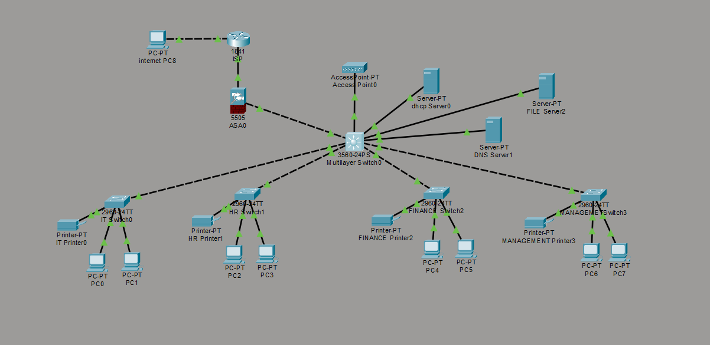
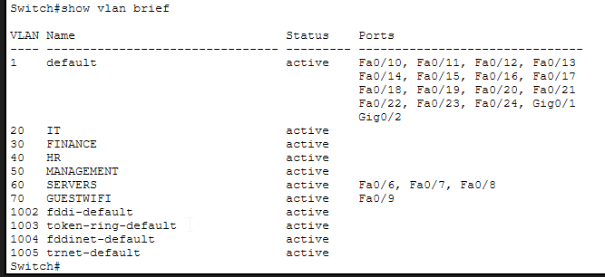
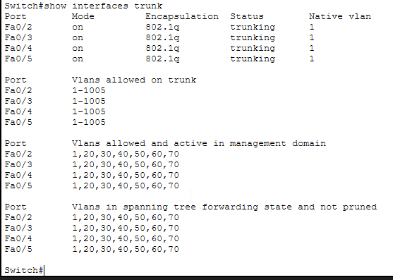
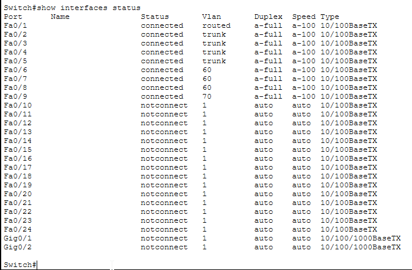
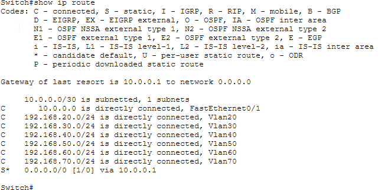
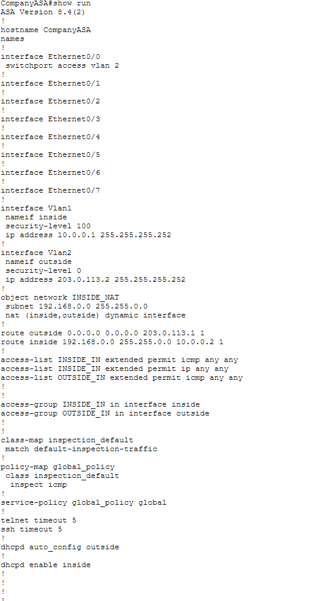
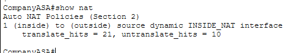
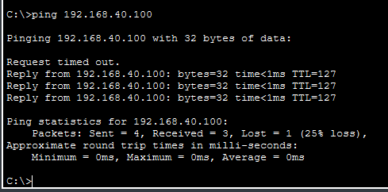
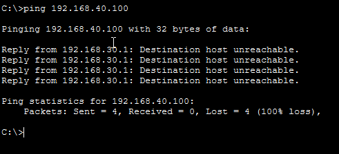
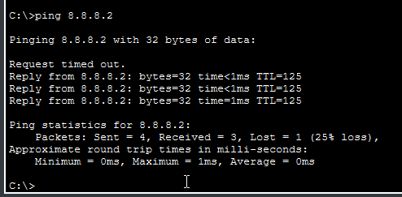

[README.md](https://github.com/user-attachments/files/29494417/README.md)
# Lab 5 — Enterprise Company Network

**Course:** Computer Networks / Networking Lab  
**Tools:** Cisco Packet Tracer  
**Student:** Ali Ahmed — 25F-CY-023  
**Institution:** Dawood University of Engineering & Technology (DUET)

---

## Overview

This lab simulates a fully functional enterprise network for a mid-sized company with multiple departments, centralised servers, a firewall, and internet connectivity. Every design decision mirrors real-world network engineering practice.

The network includes:
- Department segmentation using VLANs
- Inter-VLAN routing on a Layer 3 core switch
- Centralised DHCP, DNS, and file servers
- ACL-based security rules between departments
- ASA 5505 firewall with NAT for internet access
- Guest Wi-Fi isolated from the internal network
- ISP router simulating internet connectivity

---

## Network Topology



---

## IP Addressing Plan

| VLAN | Name | Subnet | Gateway | Purpose |
|------|------|--------|---------|---------|
| 20 | IT | 192.168.20.0/24 | 192.168.20.1 | IT department PCs and printer |
| 30 | Finance | 192.168.30.0/24 | 192.168.30.1 | Finance department PCs and printer |
| 40 | HR | 192.168.40.0/24 | 192.168.40.1 | HR department PCs and printer |
| 50 | Management | 192.168.50.0/24 | 192.168.50.1 | Management PCs and laptops |
| 60 | Servers | 192.168.60.0/24 | 192.168.60.1 | DHCP, DNS, File servers |
| 70 | GuestWiFi | 192.168.70.0/24 | 192.168.70.1 | Isolated guest wireless |
| — | ASA Inside | 10.0.0.0/30 | — | Point-to-point link: ASA ↔ Core Switch |
| — | ASA Outside | 203.0.113.0/30 | — | Point-to-point link: ASA ↔ ISP |

### Static IP Assignments

| Device | IP Address | Reason |
|--------|-----------|--------|
| DHCP Server | 192.168.60.10 | Must be reachable by all VLANs via helper-address |
| DNS Server | 192.168.60.11 | Static so all clients can reliably resolve names |
| File Server | 192.168.60.12 | Static for consistent mapped drive access |
| All Printers | x.x.x.50 per VLAN | Static so print drivers never break on IP change |
| ASA inside | 10.0.0.1 | Gateway for core switch default route |
| Core switch Fa0/1 | 10.0.0.2 | Routed port facing ASA |
| ASA outside | 203.0.113.2 | Public-facing IP for NAT |
| ISP router Fa0/0 | 203.0.113.1 | ISP gateway |
| ISP router Fa0/1 | 8.8.8.1 | Simulated internet |
| Internet-PC | 8.8.8.2 | Simulated internet server |

---

## Devices Used

| Device | Model | Role |
|--------|-------|------|
| ASA0 | Cisco ASA 5505 | Firewall, NAT, zone-based security |
| Multilayer Switch0 | Cisco 3560-24PS | Core L3 switch, inter-VLAN routing |
| IT Switch0 | Cisco 2960-24TT | Department access switch |
| HR Switch1 | Cisco 2960-24TT | Department access switch |
| FINANCE Switch2 | Cisco 2960-24TT | Department access switch |
| MANAGEMENT Switch3 | Cisco 2960-24TT | Department access switch |
| DHCP Server0 | Server-PT | Centralised DHCP for all VLANs |
| DNS Server1 | Server-PT | Internal name resolution |
| FILE Server2 | Server-PT | Shared file storage |
| Access Point0 | AccessPoint-PT | Guest wireless (VLAN 70) |
| ISP Router | Cisco 1841 | Simulates internet/ISP |
| Internet-PC | PC-PT | Simulates internet server (8.8.8.2) |
| PC0–PC7 | PC-PT | 2 PCs per department |
| 4× Printers | Printer-PT | One per department, static IP |

---

## Configuration

### Step 1 — VLANs on Core Switch

```
enable
configure terminal

vlan 20
 name IT
vlan 30
 name Finance
vlan 40
 name HR
vlan 50
 name Management
vlan 60
 name Servers
vlan 70
 name GuestWifi
end
```

Each VLAN acts as a separate virtual network. Devices in different VLANs cannot communicate unless explicitly routed — this is the foundation of department isolation.

### Step 2 — SVI Gateway IPs + IP Routing

```
configure terminal

interface vlan 20
 ip address 192.168.20.1 255.255.255.0
 no shutdown

interface vlan 30
 ip address 192.168.30.1 255.255.255.0
 no shutdown

interface vlan 40
 ip address 192.168.40.1 255.255.255.0
 no shutdown

interface vlan 50
 ip address 192.168.50.1 255.255.255.0
 no shutdown

interface vlan 60
 ip address 192.168.60.1 255.255.255.0
 no shutdown

interface vlan 70
 ip address 192.168.70.1 255.255.255.0
 no shutdown

ip routing
end
```

Each `interface vlan` creates an SVI (Switched Virtual Interface) — a logical IP address representing the entire VLAN. The `ip routing` command enables inter-VLAN routing directly on the switch, removing the need for an external router.

### Step 3 — Trunk and Access Ports on Core Switch

```
configure terminal

interface fastEthernet 0/1
 no switchport
 ip address 10.0.0.2 255.255.255.252
 no shutdown

interface fastEthernet 0/2
 switchport trunk encapsulation dot1q
 switchport mode trunk

interface fastEthernet 0/3
 switchport trunk encapsulation dot1q
 switchport mode trunk

interface fastEthernet 0/4
 switchport trunk encapsulation dot1q
 switchport mode trunk

interface fastEthernet 0/5
 switchport trunk encapsulation dot1q
 switchport mode trunk

interface fastEthernet 0/6
 switchport mode access
 switchport access vlan 60

interface fastEthernet 0/7
 switchport mode access
 switchport access vlan 60

interface fastEthernet 0/8
 switchport mode access
 switchport access vlan 60

interface fastEthernet 0/9
 switchport mode access
 switchport access vlan 70

ip route 0.0.0.0 0.0.0.0 10.0.0.1
end
```

Trunk ports carry tagged frames for multiple VLANs using 802.1Q. Access ports carry untagged frames for a single VLAN — used for servers and end devices that don't understand VLAN tags. Fa0/1 is converted to a routed port (`no switchport`) to create a Layer 3 link directly to the ASA.

### Step 4 — Access Ports on Department Switches

Each department switch follows the same pattern — trunk uplink on Fa0/1, access ports for devices:

```
enable
configure terminal

vlan [VLAN_ID]
 name [DEPT_NAME]

interface fastEthernet 0/1
 switchport mode trunk
 no shutdown

interface fastEthernet 0/2
 switchport mode access
 switchport access vlan [VLAN_ID]
 no shutdown

interface fastEthernet 0/3
 switchport mode access
 switchport access vlan [VLAN_ID]
 no shutdown

interface fastEthernet 0/4
 switchport mode access
 switchport access vlan [VLAN_ID]
 no shutdown
end
```

| Switch | VLAN ID |
|--------|---------|
| IT Switch0 | 20 |
| HR Switch1 | 40 |
| FINANCE Switch2 | 30 |
| MANAGEMENT Switch3 | 50 |

### Step 5 — DHCP Server Configuration

DHCP pools configured via the server GUI:

| Pool | Network | Start IP | Gateway | DNS |
|------|---------|----------|---------|-----|
| IT_Pool | 192.168.20.0 | 192.168.20.100 | 192.168.20.1 | 192.168.60.11 |
| Finance_Pool | 192.168.30.0 | 192.168.30.100 | 192.168.30.1 | 192.168.60.11 |
| HR_Pool | 192.168.40.0 | 192.168.40.100 | 192.168.40.1 | 192.168.60.11 |
| Management_Pool | 192.168.50.0 | 192.168.50.100 | 192.168.50.1 | 192.168.60.11 |
| Guest_Pool | 192.168.70.0 | 192.168.70.100 | 192.168.70.1 | 8.8.8.8 |

IP helper-address configured on core switch to forward DHCP broadcasts across VLANs:

```
configure terminal

interface vlan 20
 ip helper-address 192.168.60.10

interface vlan 30
 ip helper-address 192.168.60.10

interface vlan 40
 ip helper-address 192.168.60.10

interface vlan 50
 ip helper-address 192.168.60.10

interface vlan 70
 ip helper-address 192.168.60.10
end
```

Without `ip helper-address`, DHCP broadcasts die at the VLAN boundary and PCs can't get IPs. The helper converts a broadcast to a unicast sent directly to the DHCP server.

### Step 6 — ACL Security Rules

```
configure terminal

ip access-list extended FINANCE_RULES
 deny ip 192.168.30.0 0.0.0.255 192.168.40.0 0.0.0.255
 permit ip 192.168.30.0 0.0.0.255 any

ip access-list extended HR_RULES
 deny ip 192.168.40.0 0.0.0.255 192.168.30.0 0.0.0.255
 permit ip 192.168.40.0 0.0.0.255 any

ip access-list extended GUEST_RULES
 deny ip 192.168.70.0 0.0.0.255 192.168.20.0 0.0.0.255
 deny ip 192.168.70.0 0.0.0.255 192.168.30.0 0.0.0.255
 deny ip 192.168.70.0 0.0.0.255 192.168.40.0 0.0.0.255
 deny ip 192.168.70.0 0.0.0.255 192.168.50.0 0.0.0.255
 deny ip 192.168.70.0 0.0.0.255 192.168.60.0 0.0.0.255
 permit ip 192.168.70.0 0.0.0.255 any

interface vlan 30
 ip access-group FINANCE_RULES in

interface vlan 40
 ip access-group HR_RULES in

interface vlan 70
 ip access-group GUEST_RULES in
end
```

ACLs are applied `in` on the source VLAN interface — traffic is filtered as it enters the routing engine, before it reaches the destination. The `permit ip any any` at the end of each ACL is critical — without it, the implicit deny-all at the bottom of every ACL would block all traffic from that VLAN.

### Step 7 — ASA Firewall Configuration

```
configure terminal

hostname CompanyASA

interface vlan 1
 nameif inside
 security-level 100
 ip address 10.0.0.1 255.255.255.252
 no shutdown

interface vlan 2
 nameif outside
 security-level 0
 ip address 203.0.113.2 255.255.255.252
 no shutdown

interface ethernet 0/0
 switchport access vlan 2
 no shutdown

interface ethernet 0/1
 switchport access vlan 1
 no shutdown

object network INSIDE_NAT
 subnet 192.168.0.0 255.255.0.0
 nat (inside,outside) dynamic interface

route outside 0.0.0.0 0.0.0.0 203.0.113.1
route inside 192.168.0.0 255.255.0.0 10.0.0.2

access-list INSIDE_IN extended permit icmp any any
access-list INSIDE_IN extended permit ip any any
access-list OUTSIDE_IN extended permit icmp any any

access-group INSIDE_IN in interface inside
access-group OUTSIDE_IN in interface outside

class-map inspection_default
 match default-inspection-traffic

policy-map global_policy
 class inspection_default
  inspect icmp

service-policy global_policy global
end
```

Security levels control traffic flow — inside (100) can reach outside (0) freely, but outside cannot reach inside without an explicit ACL. NAT translates all `192.168.0.0/16` traffic to the ASA's outside IP before it leaves the network. The `route inside` statement tells the ASA where to send return traffic destined for internal VLANs.

---

## Verification Screenshots

### VLAN Database


### Trunk Ports


### Interface Status


### Routing Table


### ASA Running Config


### NAT Translation Hits


---

## Test Results

### Inter-VLAN Routing — PC0 (IT) pinging HR


IT department successfully reaches HR VLAN — inter-VLAN routing confirmed working.

### ACL Security — Finance blocked from HR


Finance attempting to reach HR gets `Destination host unreachable` from `192.168.30.1` — the ACL drops the packet at the source VLAN interface before it is even routed.

### Internet Access through NAT


PC0 successfully pings `8.8.8.2` (simulated internet server) — traffic flows through VLANs → core switch → ASA firewall → NAT → ISP router → internet server and back.

---

## Key Concepts Demonstrated

| Concept | Implementation |
|---------|---------------|
| VLAN segmentation | 6 VLANs isolating departments, servers, and guest WiFi |
| 802.1Q trunking | Trunk ports carry tagged frames between core and access switches |
| Inter-VLAN routing | Layer 3 SVI interfaces + `ip routing` on 3560 core switch |
| DHCP relay | `ip helper-address` forwards broadcasts across VLAN boundaries |
| Extended ACLs | Named ACLs with wildcard masks blocking Finance↔HR and isolating guests |
| ASA security zones | Inside (level 100), Outside (level 0) with zone-based policy |
| Dynamic NAT/PAT | Single public IP masking entire `192.168.0.0/16` internal range |
| Static routing | Default routes on core switch and ASA, return route for internal subnets |

---

## Files

- `Lab5-Enterprise-Network.pkt` — Packet Tracer simulation file

---

*Part of my Cisco Packet Tracer lab series documenting hands-on networking practice.*  
*GitHub: [github.com/Ali-Ahmed-glitch](https://github.com/Ali-Ahmed-glitch)*  
*LinkedIn: [linkedin.com/in/ali-ahmed-5097b1419](https://linkedin.com/in/ali-ahmed-5097b1419)*
